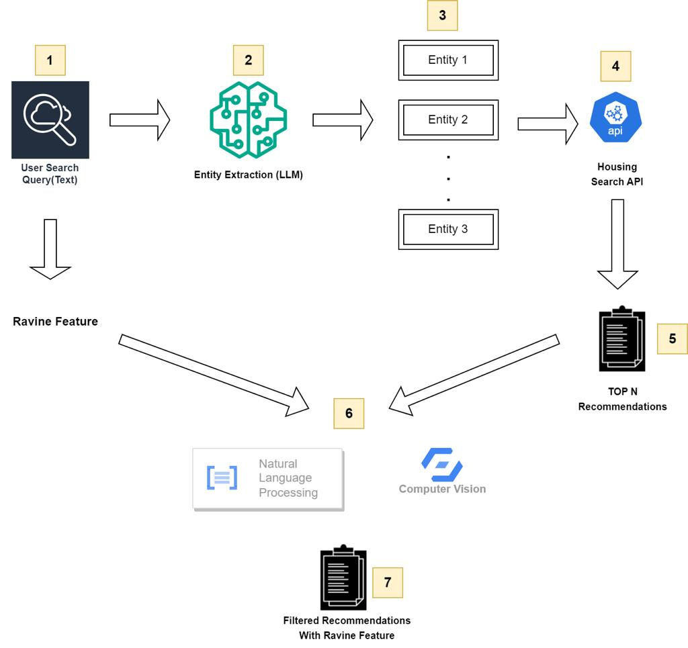

# Ilore-AI-Assisted-Property-Search-System

**Problem Statement**
The objective of this course project is to develop a system that can process a user's text input about a property of interest and then use it to generate a prompt to be fed into a large language model (LLM). The system will then use the extracted fields to search for properties on a housing website that match the given criteria.

The first step in this process will be to receive the user's text input and convert it into a prompt that can be understood by the LLM. The prompt will need to specify which fields need to be extracted from the text input, such as the property's address, neighborhood, price range, property type, number of bedrooms, and number of bathrooms.

Once the relevant fields have been extracted from the text input, the system will use them to generate a search query for the housing website's API. The API will be queried to retrieve a list of properties that match the specified features. However, some of the features that the user desires may not be explicitly mentioned in the listing.

To address this, the system will perform a post-processing step that uses AI techniques to extract any missing fields from the listing. For example, if the user mentions a ravine feature in the input text, but this feature is not mentioned in the listing, the system can use natural language processing (NLP) and computer vision techniques to analyze the listing's description and photos to identify if there is indeed a ravine feature present.
The results of the query, along with any additional fields that were extracted through post-processing, will then be returned to the user, providing them with a list of properties that meet their criteria.

This project will require the use of natural language processing (NLP) techniques to extract and process textual data, as well as API integration to connect with external housing websites. By leveraging machine learning algorithms and data analytics, this system can greatly enhance the efficiency and accuracy of property searches, making it a valuable tool for anyone in the real estate industry or those looking to buy or rent a property.

Process Map / Architecture

